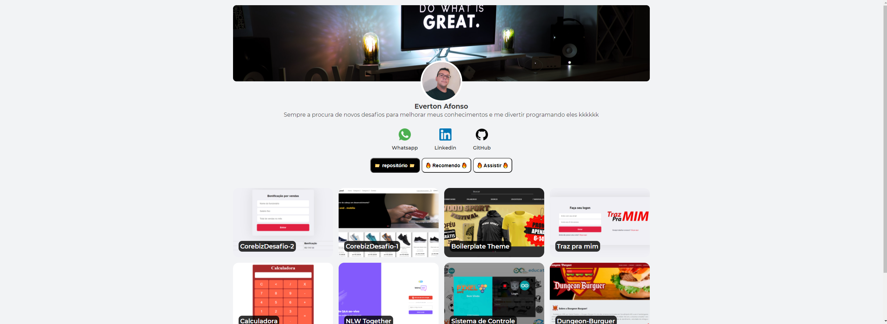

<p align="center">
  <a href="#-tecnologias">🚀 Tecnologias</a>&nbsp;&nbsp;&nbsp;|&nbsp;&nbsp;&nbsp;
  <a href="#-projeto">💻 Projeto</a>
</p>

<br>

<p align="center">
  
</p>

<br/>

<p align="center">
  Projeto desenvolvido para seleção do programa Gobeyond da Corebiz!
</p>

<br/>

## 🚀 Tecnologias

Esse projeto foi desenvolvido com as seguintes tecnologias:

### Front-end

- HTML
- CSS
- JavaScript
- ReactJS

## 💻 Projeto

### Gobeyond

Portfólio

Desenvolver um portfólio onde posso mostrar meus projetos que estou fazendo no decorrer da minha carreira.
Para visualizar como o projeto ficou clique nesse link: [Projeto](https://corebiz-desafio-3.vercel.app/)

Siga os passos abaixo caso você queira rodar o projeto na sua maquina:
```bash
#Clone the repository
$ git clone https://github.com/Everton-Afonso/CorebizDesafio-3

# Install the dependencies
$ npm i or yarn

# Start the project
$ yarn start
```
Você pode visualizar o layout do projeto clique nesse link: [adobe](https://xd.adobe.com/view/37061811-e3ad-4675-8ef5-d94bd7f2d4d6-6255/screen/e7c84a8a-2e81-45fd-91bd-1688c5be908b/specs/).

